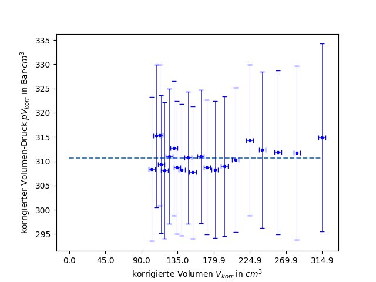
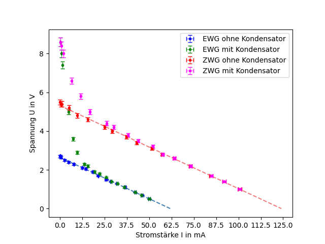
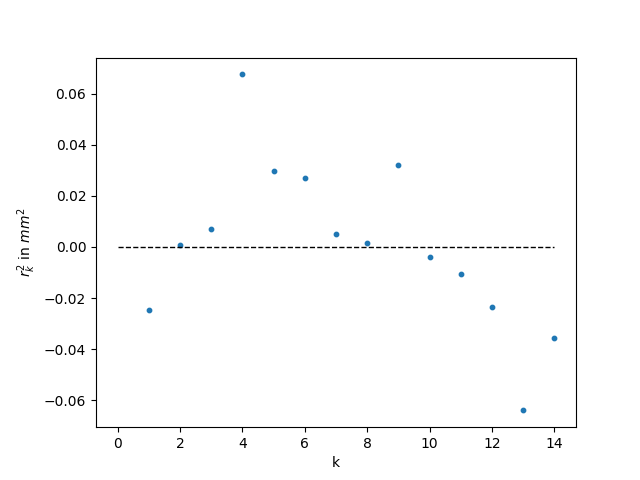

# plotting functions

Run the following commands in the terminal (current working directory: `IMP-utils` folder). You can change the available parameter of the functions in `IMP_utils_py/config/plotting.gin`. The path parameters in `plotting.gin` have to be relative to the `IMP-utils` folder.

## table of content

- [errorbar-plot](#errorbar-plot): errorbar plot with possible linear fit(with and without intercept zero)

- [residual-plot](#residual-plot): residual plot for linear fit function (with and without intercept zero)

<a name="errorbar-plot"/>

## errorbar plot

### path parameters

*(not effected by multiple plots in one graph)*

- RAW_DATA_PATH: location of the csv/excel file with the data
  - `string` e.g. "raw_data.csv" or "raw_data.xlsx"

- ERRORBAR_PLOT_PATH: location for the png of the plot
  - `string` e.g. "plot.png"

### column name parameters

- ERRORBAR_PLOT_X_COLUMN: column name of column with x values
  - `string` e.g. "L"
  - `list of strings` e.g. ["L1", "L2", "L3"]

- ERRORBAR_PLOT_X_ERROR_COLUMN: column name of column with errors of x values
  - `string` e.g. "u_L"
  - `list of strings` e.g. ["u_L1", "", "u_L3"]
  - **NOTE:** use an empty string "" to provide no error column for the x-values

- ERRORBAR_PLOT_Y_COLUMN: column name of column with y values
  - `string` e.g. "f"
  - `list of strings` e.g. ["f1", "f2", "f3"]

- ERRORBAR_PLOT_Y_ERROR_COLUMN: column name of column with errors of y values
  - `string` e.g. "u_f"
  - `list of strings` e.g. ["u_f1", "u_f2", ""]
  - **NOTE:** use an empty string "" to provide no error column for the y-values

### plot legend parameters

- ERRORBAR_PLOT_TITLE: title 
  - `string` e.g. "f(L)-Diagramm"
  - **NOTE:** use an empty string "" if there shall be no title for this plot

- ERRORBAR_PLOT_XLABEL: label of x axes
  - `string` e.g. "Länge L in m"
  - **NOTE:** use an empty string "" if there shall be no label for this axes

- ERRORBAR_PLOT_YLABEL: label of y axes
  - `string` e.g. "Frequenz f in Hz"
  - **NOTE:** use an empty string "" if there shall be no label for this axes

- ERRORBAR_PLOT_PLOTLABELS: label for plot in legend
  - `string` e.g. "Frequenz f"
  - `list of strings` e.g. ["Frequenz f1", "Frequenz f2", "Frequenz f3"]
  - **NOTE:** use an empty string "" if there shall be no label for this plot

- ERRORBAR_PLOT_XTICKS_NUMBER: number of ticks on x axes *(has sometimes to be adjusted a bit for a better laylout)*
  - `integer`

### function parameter

- ERRORBAR_PLOT_MODEL: choose the model for the linear fit
  - `string` e.g. "linear"
  - `list of strings` e.g. ["linear", "constant", "none"]
  - 'linear' *(y = m\*x + n)* / 'linear_zero' *(y = m\*x)* / 'constant' *(y = n)* / 'none' *(no fit will be created)*

<a name="errorbar-plot-info"/>

### INFO

**FOR MULTIPLE PLOTS IN ONE GRAPH:**
- use `list of strings` (with same length) instead of `string` for parameters with `list of strings` as an option
- You can use a `string` in ERRORBAR_PLOT_MODEL, it will apply to all plots
- You can use a `string` in ERRORBAR_PLOT_X_COLUMN and ERRORBAR_PLOT_X_ERROR_COLUMN, the x values will be used for every set of y values

When *ERRORBAR_PLOT_MODEL* is not *'none'*, the x-/y-values and x-/y-error-values are used to create a linear fit with the [kafe2](https://github.com/PhiLFitters/kafe2) library. The advantage of kafe2 compared to excel or scipy is that the errors in x- and y-axes are used to calculate the increase and also the error of the increase. The parameters of the fit and also their errors will be logged in the console.

If you input more than 5 y-value column names, the plot colors will not be unique anymore.

### only errorplot example

<p align="left">
  
</p>

<details><summary>parameters</summary>

``` // opening
RAW_DATA_PATH = "data/Grundpraktikum/T4_V.csv"
ERRORBAR_PLOT_PATH = "data/graphics/plot_T4_V.png"
ERRORBAR_PLOT_X_COLUMN = 'V'
ERRORBAR_PLOT_X_ERROR_COLUMN = "u_V"
ERRORBAR_PLOT_Y_COLUMN = "p"
ERRORBAR_PLOT_Y_ERROR_COLUMN = "u_p"
ERRORBAR_PLOT_TITLE = ""
ERRORBAR_PLOT_XLABEL = "Druck p in Bar"
ERRORBAR_PLOT_YLABEL = "Volumen V in $cm^3$"
ERRORBAR_PLOT_XTICKS_NUMBER = 8
ERRORBAR_PLOT_PLOTLABELS = ""
ERRORBAR_PLOT_MODEL = "none"
```
</details>

### constant plot example

<p align="left">
  
</p>

<details><summary>parameters</summary>

``` // opening
RAW_DATA_PATH = "data/Grundpraktikum/T4_V.csv"
ERRORBAR_PLOT_PATH = "data/graphics/plot_T4_pV_korr.png"
ERRORBAR_PLOT_X_COLUMN = 'V_korr'
ERRORBAR_PLOT_X_ERROR_COLUMN = "u_V_korr"
ERRORBAR_PLOT_Y_COLUMN = "pV_korr"
ERRORBAR_PLOT_Y_ERROR_COLUMN = "u_pV_korr"
ERRORBAR_PLOT_TITLE = ""
ERRORBAR_PLOT_XLABEL = "korrigierte Volumen $V_{korr}$ in $cm^3$"
ERRORBAR_PLOT_YLABEL = "korrigierter Volumen-Druck $pV_{korr}$ in Bar$\cdot cm^3$"
ERRORBAR_PLOT_XTICKS_NUMBER = 8
ERRORBAR_PLOT_PLOTLABELS = ""
ERRORBAR_PLOT_MODEL = "constant"
```
</details>

### linear plot example

<p align="left">
  
</p>

<details><summary>parameters</summary>

``` // opening
RAW_DATA_PATH = "data/Grundpraktikum/O6_bhg.csv"
ERRORBAR_PLOT_PATH = "data/graphics/plot_O6_bhg.png"
ERRORBAR_PLOT_X_COLUMN = 'k'
ERRORBAR_PLOT_X_ERROR_COLUMN = ""
ERRORBAR_PLOT_Y_COLUMN = "y"
ERRORBAR_PLOT_Y_ERROR_COLUMN = "uy"
ERRORBAR_PLOT_TITLE = ""
ERRORBAR_PLOT_XLABEL = "k"
ERRORBAR_PLOT_YLABEL = "$r_k^2$ in $mm^2$"
ERRORBAR_PLOT_XTICKS_NUMBER = 8
ERRORBAR_PLOT_PLOTLABELS = ""
ERRORBAR_PLOT_MODEL = "linear"
```
</details>

### multiple all linear plots example

<p align="left">
  
</p>

<details><summary>parameters</summary>

``` // opening
RAW_DATA_PATH = "data/Grundpraktikum/M12_kg.csv"
ERRORBAR_PLOT_PATH = "data/graphics/plot_M12_kg.png"
ERRORBAR_PLOT_X_COLUMN = 'n'
ERRORBAR_PLOT_X_ERROR_COLUMN = ""
ERRORBAR_PLOT_Y_COLUMN = ["f_1kg", "f_2kg", "f_3kg"]
ERRORBAR_PLOT_Y_ERROR_COLUMN = ["u_1kg", "u_2kg", "u_3kg"]
ERRORBAR_PLOT_TITLE = ""
ERRORBAR_PLOT_XLABEL = "n"
ERRORBAR_PLOT_YLABEL = "Frequenzen $f_n$ in Hz für 1kg/2kg/3kg"
ERRORBAR_PLOT_XTICKS_NUMBER = 8
ERRORBAR_PLOT_PLOTLABELS = ["1kg", "2kg", "3kg"]
ERRORBAR_PLOT_MODEL = "linear"
```
</details>

### multiple linear/none plots example

<p align="left">
  
</p>

<details><summary>parameters</summary>

``` // opening
RAW_DATA_PATH = "data/Grundpraktikum/E5_UI.csv"
ERRORBAR_PLOT_PATH = "data/graphics/plot_E5_UI.png"
ERRORBAR_PLOT_X_COLUMN = ["I_EoK", "I_EmK", "I_ZoK", "I_ZmK"]
ERRORBAR_PLOT_X_ERROR_COLUMN = ["u_I_EoK", "u_I_EmK", "u_I_ZoK", "u_I_ZmK"]
ERRORBAR_PLOT_Y_COLUMN = ["U_EoK", "U_EmK", "U_ZoK", "U_ZmK"]
ERRORBAR_PLOT_Y_ERROR_COLUMN = ["u_U_EoK", "u_U_EmK", "u_U_ZoK", "u_U_ZmK"]
ERRORBAR_PLOT_TITLE = ""
ERRORBAR_PLOT_XLABEL = r"Stromstärke I in mA"
ERRORBAR_PLOT_YLABEL = r"Spannung U in V"
ERRORBAR_PLOT_XTICKS_NUMBER = 9
ERRORBAR_PLOT_PLOTLABELS = ["EWG ohne Kondensator", "EWG mit Kondensator", "ZWG ohne Kondensator", "ZWG mit Kondensator"]
ERRORBAR_PLOT_MODEL = ["linear", "none", "linear", "none"]
```
</details>

### command

```
python IMP_utils_py/cli.py --mode=errorbar-plot --gin_file=IMP_utils_py/config/plotting.gin
```

---

<a name="residual-plot"/>

## residual plot

### path parameters

- RAW_DATA_PATH: location of the csv/excel file with the data
  - `string` e.g. "raw_data.csv" or "raw_data.xlsx"

- RESIDUAL_PLOT_PATH: location for the png of the plot
  - `string` e.g. "plot.png"

### column name parameters

- ERRORBAR_PLOT_X_COLUMN: column name of column with x values
  - `string` e.g. "L"

- ERRORBAR_PLOT_X_ERROR_COLUMN: column name of column with errors of x values
  - `string` e.g. "u_L"
  - **NOTE:** use an empty string "" to provide no error column for the x-values

- ERRORBAR_PLOT_Y_COLUMN: 
  - column name of column with y values
    - `string` e.g. "f"

- ERRORBAR_PLOT_Y_ERROR_COLUMN:
  - column name of column with errors of y values
    - `string` e.g. "u_f"
  - **NOTE:** use an empty string "" to provide no error column for the y-values

### plot legend parameters

- ERRORBAR_PLOT_TITLE: title 
  - `string` e.g. "f(L)-Diagramm"
  - **NOTE:** use an empty string "" if there shall be no title for this plot

- ERRORBAR_PLOT_XLABEL: label of x axes
  - `string` e.g. "Länge L in m"
  - **NOTE:** use an empty string "" if there shall be no label for this axes

- ERRORBAR_PLOT_YLABEL: label of y axes
  - `string` e.g. "Frequenz f in Hz"
  - **NOTE:** use an empty string "" if there shall be no label for this axes

- ERRORBAR_PLOT_XTICKS_NUMBER: number of ticks on x axes *(has sometimes to be adjusted a bit for a better laylout)*
  - `integer`

### function parameter

- ERRORBAR_PLOT_MODEL: choose the model for the linear fit
  - `string`
  - 'linear' *(y = m\*x + n)* / 'linear_zero' *(y = m\*x)* / 'constant' *(y = n)*

### INFO

The residual plot represents the residuals *(actual_y_value − predicted_y_value)* of the linear fit-function mentioned in [errorbar-plot](#errorbar-plot-info).

You can only use one set of y-values and not multiple like in errorbar-plot.

### example plot

<p align="left">
  
</p>

<details><summary>parameters</summary>

``` // opening
RAW_DATA_PATH = "data/Grundpraktikum/O6_bhg.csv"
RESIDUAL_PLOT_PATH = "data/graphics/plot_O6_bhg_residual.png"
ERRORBAR_PLOT_X_COLUMN = 'k'
ERRORBAR_PLOT_X_ERROR_COLUMN = ""
ERRORBAR_PLOT_Y_COLUMN = "y"
ERRORBAR_PLOT_Y_ERROR_COLUMN = "uy"
ERRORBAR_PLOT_TITLE = ""
ERRORBAR_PLOT_XLABEL = "k"
ERRORBAR_PLOT_YLABEL = "$r_k^2$ in $mm^2$"
ERRORBAR_PLOT_XTICKS_NUMBER = 8
ERRORBAR_PLOT_MODEL = "linear"
```
</details>

### command

```
python IMP_utils_py/cli.py --mode=residual-plot --gin_file=IMP_utils_py/config/plotting.gin
```

