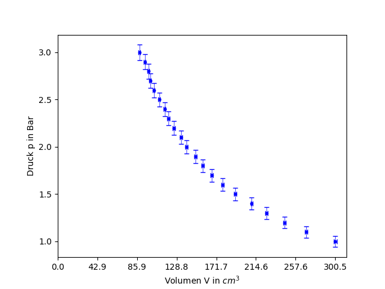
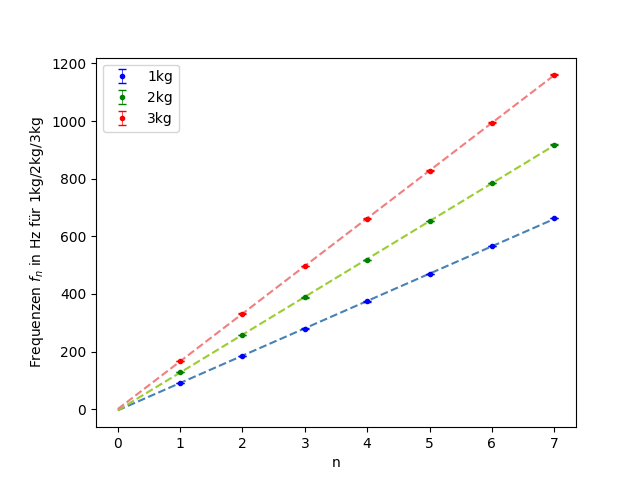

# plotting functions

Run the following commands in the terminal (current working directory: `IMP-utils` folder). You can change the available parameter of the functions in `IMP_utils_py/config/plotting.gin`. The path parameters in `plotting.gin` have to be relative to the `IMP-utils` folder.

## table of content

- [errorbar-plot](#errorbar-plot): errorbar plot with possible linear fit(with and without intercept zero)

- [residual-plot](#residual-plot): residual plot for linear fit function (with and without intercept zero)

<a name="errorbar-plot"/>

## errorbar plot

### path parameters

- RAW_DATA_PATH: location of the csv/excel file with the data
  - `string` e.g. "raw_data.csv" or "raw_data.xlsx"

- ERRORBAR_PLOT_PATH: location for the png of the plot
  - `string` e.g. "plot.png"

### column name parameters

- ERRORBAR_PLOT_X_COLUMN: column name of column with x values
  - `string` e.g. "L"

- ERRORBAR_PLOT_X_ERROR_COLUMN: column name of column with errors of x values
  - `string` e.g. "u_L"
  - **NOTE:** use an empty string "" to provide no error column for the x-values

- ERRORBAR_PLOT_Y_COLUMN: 
  - column name of column with y values
    - `string` e.g. "f"
  - list of column names with y values *(for multiple linear plots in one graph)*
    - `list of strings` e.g. ["f1", "f2", "f3"]

- ERRORBAR_PLOT_Y_ERROR_COLUMN:
  - column name of column with errors of y values
    - `string` e.g. "u_f"
  - list of column names of columns with errors of y values *(for multiple linear plots in one graph)*
    - `list of strings` e.g. ["u_f1", "u_f2", "u_f3"]
  - **NOTE:** use an empty string "" to provide no error column for the y-values

### plot legend parameters

- ERRORBAR_PLOT_TITLE: title 
  - `string` e.g. "f(L)-Diagramm"
  - **NOTE:** use an empty string "" if there shall be no title for this plot

- ERRORBAR_PLOT_XLABEL: label of x axes
  - `string` e.g. "Länge L in m"
  - **NOTE:** use an empty string "" if there shall be no label for this axes

- ERRORBAR_PLOT_YLABEL: label of y axes
  - `string` e.g. "Frequenz f in Hz"
  - **NOTE:** use an empty string "" if there shall be no label for this axes

- ERRORBAR_PLOT_XTICKS_NUMBER: number of ticks on x axes *(has sometimes to be adjusted a bit for a better laylout)*
  - `integer`

### function parameter only used with `ERRORBAR_PLOT_SHOW_FIT = True`

- ERRORBAR_PLOT_SHOW_FIT: if False, no linear fit will be created and just the errorbar displayed
  - `boolean`

- ERRORBAR_PLOT_MODEL: choose the model for the linear fit
  - `string`
  - 'linear' *(y = m\*x + n)* / 'linear_zero' *(y = m\*x)* / 'constant' *(y = n)*

- ERRORBAR_PLOT_PLOTLABELS:
  - label for plot in legend
    - `string` e.g. "Frequenz f"
  - list of labels for plots in legend
    - `list of strings` e.g. ["Frequenz f1", "Frequenz f2", "Frequenz f3"]
  - **NOTE:** use an empty string "" if there shall be no label for this plot

<a name="errorbar-plot-info"/>

### INFO

When *ERRORBAR_PLOT_SHOW_FIT = True*, the x-/y-values and x-/y-error-values are used to create a linear fit with the [kafe2](https://github.com/PhiLFitters/kafe2) library. The advantage of kafe2 compared to excel or scipy is that the errors in x- and y-axes are used to calculate the increase and also the error of the increase. The parameters of the fit and also their errors will be logged in the console.

If you input more than 5 y-value column names, the plot colors will not be unique anymore.

### only errorplot example

<p align="left">
  
</p>

### constant plot example

<p align="left">
  
</p>

### linear plot example

<p align="left">
  
</p>

### multiple linear plots example

<p align="left">
  
</p>

### command

```
python IMP_utils_py/cli.py --mode=errorbar-plot --gin_file=IMP_utils_py/config/plotting.gin
```

---

<a name="residual-plot"/>

## residual plot

### path parameters

- RAW_DATA_PATH: location of the csv/excel file with the data
  - `string` e.g. "raw_data.csv" or "raw_data.xlsx"

- RESIDUAL_PLOT_PATH: location for the png of the plot
  - `string` e.g. "plot.png"

### column name parameters

- ERRORBAR_PLOT_X_COLUMN: column name of column with x values
  - `string` e.g. "L"

- ERRORBAR_PLOT_X_ERROR_COLUMN: column name of column with errors of x values
  - `string` e.g. "u_L"
  - **NOTE:** use an empty string "" to provide no error column for the x-values

- ERRORBAR_PLOT_Y_COLUMN: 
  - column name of column with y values
    - `string` e.g. "f"

- ERRORBAR_PLOT_Y_ERROR_COLUMN:
  - column name of column with errors of y values
    - `string` e.g. "u_f"
  - **NOTE:** use an empty string "" to provide no error column for the y-values

### plot legend parameters

- ERRORBAR_PLOT_TITLE: title 
  - `string` e.g. "f(L)-Diagramm"
  - **NOTE:** use an empty string "" if there shall be no title for this plot

- ERRORBAR_PLOT_XLABEL: label of x axes
  - `string` e.g. "Länge L in m"
  - **NOTE:** use an empty string "" if there shall be no label for this axes

- ERRORBAR_PLOT_YLABEL: label of y axes
  - `string` e.g. "Frequenz f in Hz"
  - **NOTE:** use an empty string "" if there shall be no label for this axes

- ERRORBAR_PLOT_XTICKS_NUMBER: number of ticks on x axes *(has sometimes to be adjusted a bit for a better laylout)*
  - `integer`

### function parameter

- ERRORBAR_PLOT_MODEL: choose the model for the linear fit
  - `string`
  - 'linear' *(y = m\*x + n)* / 'linear_zero' *(y = m\*x)* / 'constant' *(y = n)*

### INFO

The residual plot represents the residuals *(actual_y_value − predicted_y_value)* of the linear fit-function mentioned in [errorbar-plot](#errorbar-plot-info).

You can only use one set of y-values and not multiple like in errorbar-plot.

### example plot

<p align="left">
  
</p>

### command

```
python IMP_utils_py/cli.py --mode=residual-plot --gin_file=IMP_utils_py/config/plotting.gin
```

