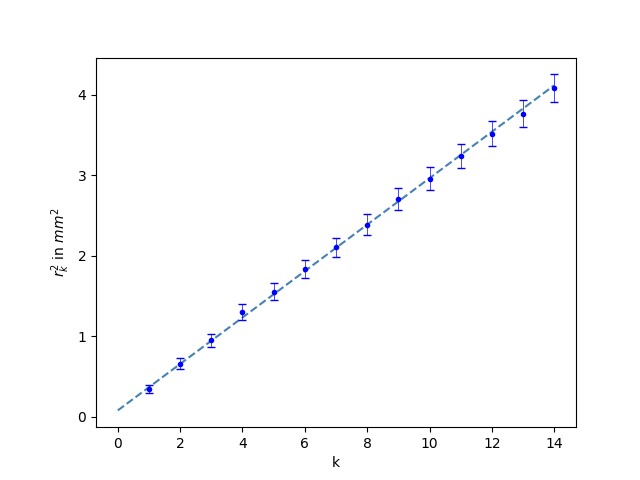

# plotting examples

Some examples of the [plotting command set](plotting.md) to help you understand it.

## errorbar plot

### only errorplot example

<p align="left">
  
</p>

<details><summary>parameters</summary>

``` // opening
RAW_DATA_PATH = "data/Grundpraktikum/T4_V.csv"
ERRORBAR_PLOT_PATH = "data/graphics/plot_T4_V.png"
ERRORBAR_PLOT_X_COLUMN = 'V'
ERRORBAR_PLOT_X_ERROR_COLUMN = "u_V"
ERRORBAR_PLOT_Y_COLUMN = "p"
ERRORBAR_PLOT_Y_ERROR_COLUMN = "u_p"
ERRORBAR_PLOT_TITLE = ""
ERRORBAR_PLOT_XLABEL = "Druck p in Bar"
ERRORBAR_PLOT_YLABEL = "Volumen V in $cm^3$"
ERRORBAR_PLOT_XTICKS_NUMBER = 8
ERRORBAR_PLOT_MAX_XTICKS = "auto"
ERRORBAR_PLOT_PLOTLABELS = ""
ERRORBAR_PLOT_MODEL = "none"
ERRORBAR_PLOT_EXTRA_LOG = False
```
</details>

### constant plot example

<p align="left">
  
</p>

<details><summary>parameters</summary>

``` // opening
RAW_DATA_PATH = "data/Grundpraktikum/T4_V.csv"
ERRORBAR_PLOT_PATH = "data/graphics/plot_T4_pV_korr.png"
ERRORBAR_PLOT_X_COLUMN = 'V_korr'
ERRORBAR_PLOT_X_ERROR_COLUMN = "u_V_korr"
ERRORBAR_PLOT_Y_COLUMN = "pV_korr"
ERRORBAR_PLOT_Y_ERROR_COLUMN = "u_pV_korr"
ERRORBAR_PLOT_TITLE = ""
ERRORBAR_PLOT_XLABEL = "korrigierte Volumen $V_{korr}$ in $cm^3$"
ERRORBAR_PLOT_YLABEL = "korrigierter Volumen-Druck $pV_{korr}$ in Bar$\cdot cm^3$"
ERRORBAR_PLOT_XTICKS_NUMBER = 8
ERRORBAR_PLOT_MAX_XTICKS = "auto"
ERRORBAR_PLOT_PLOTLABELS = ""
ERRORBAR_PLOT_MODEL = "constant"
ERRORBAR_PLOT_EXTRA_LOG = False
```
</details>

### linear plot example

<p align="left">
  
</p>

<details><summary>parameters</summary>

``` // opening
RAW_DATA_PATH = "data/Grundpraktikum/O6_bhg.csv"
ERRORBAR_PLOT_PATH = "data/graphics/plot_O6_bhg.png"
ERRORBAR_PLOT_X_COLUMN = 'k'
ERRORBAR_PLOT_X_ERROR_COLUMN = ""
ERRORBAR_PLOT_Y_COLUMN = "y"
ERRORBAR_PLOT_Y_ERROR_COLUMN = "uy"
ERRORBAR_PLOT_TITLE = ""
ERRORBAR_PLOT_XLABEL = "k"
ERRORBAR_PLOT_YLABEL = "$r_k^2$ in $mm^2$"
ERRORBAR_PLOT_XTICKS_NUMBER = "auto"
ERRORBAR_PLOT_MAX_XTICKS = "auto"
ERRORBAR_PLOT_PLOTLABELS = ""
ERRORBAR_PLOT_MODEL = "linear"
ERRORBAR_PLOT_EXTRA_LOG = False
```
</details>

### multiple all linear plots example

<p align="left">
  
</p>

<details><summary>parameters</summary>

``` // opening
RAW_DATA_PATH = "data/Grundpraktikum/M12_kg.csv"
ERRORBAR_PLOT_PATH = "data/graphics/plot_M12_kg.png"
ERRORBAR_PLOT_X_COLUMN = 'n'
ERRORBAR_PLOT_X_ERROR_COLUMN = ""
ERRORBAR_PLOT_Y_COLUMN = ["f_1kg", "f_2kg", "f_3kg"]
ERRORBAR_PLOT_Y_ERROR_COLUMN = ["u_1kg", "u_2kg", "u_3kg"]
ERRORBAR_PLOT_TITLE = ""
ERRORBAR_PLOT_XLABEL = "n"
ERRORBAR_PLOT_YLABEL = "Frequenzen $f_n$ in Hz für 1kg/2kg/3kg"
ERRORBAR_PLOT_XTICKS_NUMBER = 8
ERRORBAR_PLOT_MAX_XTICKS = "auto"
ERRORBAR_PLOT_PLOTLABELS = ["1kg", "2kg", "3kg"]
ERRORBAR_PLOT_MODEL = "linear"
ERRORBAR_PLOT_EXTRA_LOG = False
```
</details>

### multiple linear/none plots example

<p align="left">
  
</p>

<details><summary>parameters</summary>

``` // opening
RAW_DATA_PATH = "data/Grundpraktikum/E5_UI.csv"
ERRORBAR_PLOT_PATH = "data/graphics/plot_E5_UI.png"
ERRORBAR_PLOT_X_COLUMN = ["I_EoK", "I_EmK", "I_ZoK", "I_ZmK"]
ERRORBAR_PLOT_X_ERROR_COLUMN = ["u_I_EoK", "u_I_EmK", "u_I_ZoK", "u_I_ZmK"]
ERRORBAR_PLOT_Y_COLUMN = ["U_EoK", "U_EmK", "U_ZoK", "U_ZmK"]
ERRORBAR_PLOT_Y_ERROR_COLUMN = ["u_U_EoK", "u_U_EmK", "u_U_ZoK", "u_U_ZmK"]
ERRORBAR_PLOT_TITLE = ""
ERRORBAR_PLOT_XLABEL = r"Stromstärke I in mA"
ERRORBAR_PLOT_YLABEL = r"Spannung U in V"
ERRORBAR_PLOT_XTICKS_NUMBER = 11
ERRORBAR_PLOT_MAX_XTICKS = 125
ERRORBAR_PLOT_PLOTLABELS = ["EWG ohne Kondensator", "EWG mit Kondensator", "ZWG ohne Kondensator", "ZWG mit Kondensator"]
ERRORBAR_PLOT_MODEL = ["linear", "none", "linear", "none"]
ERRORBAR_PLOT_EXTRA_LOG = True
```
</details>

## residual plot

### example plot

<p align="left">
  
</p>

<details><summary>parameters</summary>

``` // opening
RAW_DATA_PATH = "data/Grundpraktikum/O6_bhg.csv"
RESIDUAL_PLOT_PATH = "data/graphics/plot_O6_bhg_residual.png"
ERRORBAR_PLOT_X_COLUMN = 'k'
ERRORBAR_PLOT_X_ERROR_COLUMN = ""
ERRORBAR_PLOT_Y_COLUMN = "y"
ERRORBAR_PLOT_Y_ERROR_COLUMN = "uy"
ERRORBAR_PLOT_TITLE = ""
ERRORBAR_PLOT_XLABEL = "k"
ERRORBAR_PLOT_YLABEL = "$r_k^2$ in $mm^2$"
ERRORBAR_PLOT_XTICKS_NUMBER = "auto"
ERRORBAR_PLOT_MAX_XTICKS = "auto"
ERRORBAR_PLOT_MODEL = "linear"
```
</details>
